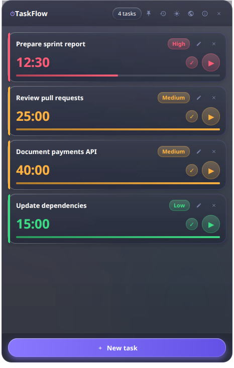
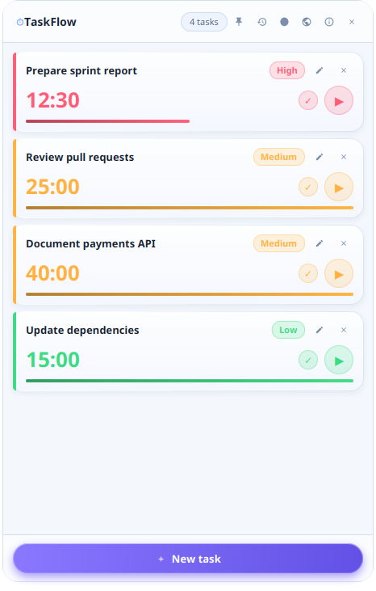

# TaskFlow

A lightweight, cross-platform desktop task manager with Pomodoro-style timers, built with Java 21 and JavaFX. Tasks are persisted locally in SQLite, and the application ships as a native package with a bundled Java runtime — no Java installation required for end users.

[](https://github.com/marodriguezd/TaskFlow/actions/workflows/ci.yml)
[](https://github.com/marodriguezd/TaskFlow/releases/latest)
[](LICENSE)

## Screenshots

| Dark theme | Light theme |
| --- | --- |
|  |  |

## Features

- **Task management** — create, edit, complete, and delete tasks
- **Priorities** — assign a priority level to each task
- **Pomodoro timers** — per-task countdown timers
- **Single active timer invariant** — starting a timer automatically pauses any other running timer (autopause)
- **Progress tracking** — visual progress bar for the active session
- **History & restoration** — completed and deleted tasks are logged to a history with the ability to restore them
- **Internationalization** — interface in 5 languages (English, Español, Deutsch, Italiano, 中文简体) with live switching, first-run OS language detection, and deterministic English fallback
- **SQLite persistence** — all tasks, history, and preferences are stored locally in a SQLite database
- **Theme switching** — light and dark themes
- **Always-on-top mode** — toggleable window pinning
- **Window geometry persistence** — window position and size are remembered between sessions
- **Legacy data migration** — automatic one-time import of JSON data from previous versions
- **Audio notification** — a bell chime plays when a timer completes (user-replaceable)

## Technology

| Area | Technology |
| --- | --- |
| Language | Java 21 |
| UI toolkit | JavaFX 21 |
| Build | Gradle (Kotlin DSL, wrapper included) |
| Persistence | SQLite via JDBC (`sqlite-jdbc`) |
| Testing | JUnit 5, AssertJ |
| Code style | Spotless with Google Java Format |
| Packaging | `jpackage` with a bundled Java 21 runtime |
| Logging | SLF4J + Logback |
| Legacy migration | Jackson (JSON) |
| Internationalization | Java `ResourceBundle` (UTF-8, 5 locales) |

The CI pipeline builds, tests, formats-checks, and packages the application on Ubuntu, Windows, and macOS.

## Architecture

The codebase follows a layered structure with a clear separation between presentation, application services, domain model, persistence, and platform integration. Package root: `io.github.marodriguezd.taskflow`.

```
io.github.marodriguezd.taskflow
├── TaskFlowApp           # JavaFX Application entry point
├── TaskFlowLauncher      # Static main() launcher
├── domain/               # Pure model classes, no framework dependencies
│   ├── Task, Priority
│   ├── HistoryItem, HistoryEventType
│   ├── ThemeMode, UserPreferences, WindowGeometry
├── persistence/          # SQLite data access
│   ├── DatabaseManager               # Connection & schema management
│   ├── TaskRepository / SqliteTaskRepository
│   ├── HistoryRepository / SqliteHistoryRepository
│   ├── PreferenceRepository / SqlitePreferenceRepository
│   ├── LegacyDataMigrator            # Legacy JSON → SQLite import
│   └── PersistenceException
├── service/              # Application/business services
│   ├── TaskService       # Task use cases & validation
│   ├── TimerService      # Countdown timers, single-active-timer enforcement
│   ├── PlatformService   # OS detection, data directories, platform defaults
│   ├── SoundService      # Timer completion audio
│   └── ValidationException
├── ui/                   # JavaFX presentation layer
│   ├── MainWindow
│   ├── component/        # HeaderView, TaskCardView, ProgressBarView,
│   │                     # EmptyStateView, Icons
│   ├── dialog/           # AddTaskDialog, EditTaskDialog, HistoryDialog
│   ├── i18n/             # Messages, LocaleManager, Languages, PriorityLabels
│   └── theme/            # ThemeManager, UIConstants
└── util/                 # DateTimeUtil, TimeFormatter
```

- **`ui`** knows nothing about JDBC; it talks to **`service`**, which orchestrates **`domain`** and **`persistence`**.
- **`domain`** is dependency-free and fully unit-testable.
- **`persistence`** is the only layer that touches SQLite, exposed through repository interfaces.
- **`service.PlatformService`** isolates all operating-system-specific behavior (data directories, windowing conventions, default always-on-top state).

Resources live under `src/main/resources`: the CSS themes (`css/base.css`, `css/light.css`, `css/dark.css`), the translation bundles (`i18n/messages*.properties`), application icons (`assets/`), the default notification sound (`assets/bell.mp3`), and the Logback configuration.

## Getting Started

### Prerequisites

- A JDK 21 (the Gradle toolchain will locate or provision one)

### Running in development

```bash
./gradlew run
```

### Common commands

```bash
./gradlew test             # Run the test suite
./gradlew spotlessCheck    # Verify code formatting
./gradlew spotlessApply    # Apply code formatting
./gradlew build            # Compile, test, and assemble
./gradlew jpackageImage    # Build a standalone application image with jpackage
./gradlew jpackagePackage  # Build a native package (msi/dmg/AppImage) for the current OS
```

The packaged application image is written to `build/dist/TaskFlow` and can be launched directly:

```bash
./build/dist/TaskFlow/bin/TaskFlow
```

## Distribution

`./gradlew jpackageImage` produces a self-contained application image via [`jpackage`](https://docs.oracle.com/en/java/javase/21/docs/specs/man/jpackage.html). The image bundles a Java 21 runtime, so **end users do not need Java installed** to run the packaged application.

`./gradlew jpackagePackage` builds a native installer package for the current operating system:

| OS | Package type |
| --- | --- |
| Windows | `.msi` |
| macOS | `.dmg` |
| Linux | `.AppImage` (portable, runs on any x86_64 distribution) |

TaskFlow runs on Windows, Linux, and macOS. GitHub Actions workflows (`.github/workflows/ci.yml`, `.github/workflows/release.yml`) build and package the application on all three platforms.

### Releases

> **Latest: [TaskFlow v1.1.0](https://github.com/marodriguezd/TaskFlow/releases/tag/v1.1.0)** — the internationalization release, published in October 2026. It adds the five-language interface (English, Spanish, German, Italian, Simplified Chinese) with live switching and first-run language detection, and it ships native packages with a bundled Java 21 runtime for Windows (`.msi`), Linux (`.AppImage`, portable), and macOS (`.dmg`, Apple Silicon), plus SHA-256 checksums for verifying each download.

Official releases are published automatically on the [GitHub Releases page](https://github.com/marodriguezd/TaskFlow/releases) when a `vMAJOR.MINOR.PATCH` tag is pushed (e.g. `v1.0.0`). The pipeline:

1. validates the tag format, that it matches the Gradle project version, and that it points at the built commit;
2. builds and tests the application on Windows, Linux, and macOS runners;
3. produces the native installer for each platform with `jpackage`;
4. verifies a `RELEASE_VERSION` provenance stamp bundled with every artifact;
5. publishes a stable GitHub Release with the `.msi`, `.AppImage`, and `.dmg` packages plus SHA-256 `checksums.txt`.

Each installer bundles a Java 21 runtime, so end users do not need Java installed.

## Data

TaskFlow stores all user data in a per-user directory containing the SQLite database (`taskflow.db`) and the notification sound (`bell.mp3`). The location depends on the platform:

| Platform | Data directory |
| --- | --- |
| Windows | `%APPDATA%\TaskFlow` |
| macOS | `~/Library/Application Support/TaskFlow` |
| Linux | `$XDG_DATA_HOME/TaskFlow`, falling back to `~/.TaskFlow` |

If a legacy `~/.TaskFlow` directory already exists, it is kept as the data directory for continuity.

## Language

TaskFlow's interface ships in exactly five languages:

| Language | Tag |
| --- | --- |
| English | `en` |
| Spanish | `es` |
| German | `de` |
| Italian | `it` |
| Simplified Chinese | `zh-Hans` |

- **Live switching** — pick a language from the globe button in the header; the whole UI (including open state such as the task badge and tooltips) re-renders immediately, without restarting.
- **Persistent per user** — the choice is stored in the `preferences` table (`language` key) as a locale-independent BCP 47 tag. Existing databases from 1.0.0 need no migration: the key is simply added on first save.
- **First-run detection** — on first launch the interface language is detected from the OS locale. Unsupported OS languages (including French and Portuguese) fall back to English; Traditional Chinese locales also fall back to English, since only Simplified Chinese is shipped.
- **Deterministic English fallback** — translations live in `src/main/resources/i18n/messages*.properties`; any missing key resolves to the English base bundle, and a key missing everywhere is returned as-is (logged once) rather than crashing. The test suite enforces that exactly these five bundles exist and are complete (key and placeholder parity).
- **Not translated** — log output, database values, priority/history codes, and internal identifiers remain locale-independent English for data compatibility.

## Migration

If you used a previous version of TaskFlow that stored data as JSON, the application detects the legacy files on first launch and imports them into SQLite automatically:

- `taskflow_data.json` (tasks)
- `taskflow_history.json` (history)
- `taskflow_geometry.json` (window geometry)
- `taskflow_settings.json` (theme and window preferences)

Legacy files are looked up in the data directory and in the home directory root (`~/.taskflow_data.json`, `~/.taskflow_history.json`, `~/.taskflow_geometry.json`). Each processed file is renamed with a `.migrated` suffix (e.g. `taskflow_data.json.migrated`) so it is imported only once; the original contents are preserved as a backup. Migration failures are logged and never prevent the application from starting.

## Development

- **Formatting** is enforced with Spotless (Google Java Format, AOSP style). Run `./gradlew spotlessApply` before committing; CI fails on `spotlessCheck` violations.
- **Tests** use JUnit 5 with AssertJ and cover the domain model, services, repositories, legacy migration, internationalization (bundle completeness, fallback, language detection), and an end-to-end application flow. All tests run headless — no display or JavaFX toolkit required.

## License

This project is licensed under the [Creative Commons Attribution-NonCommercial-ShareAlike 4.0 International License](LICENSE) (CC BY-NC-SA 4.0).
